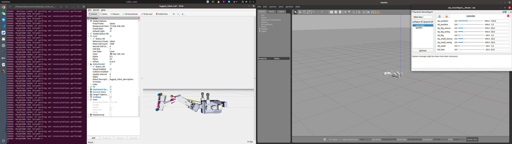
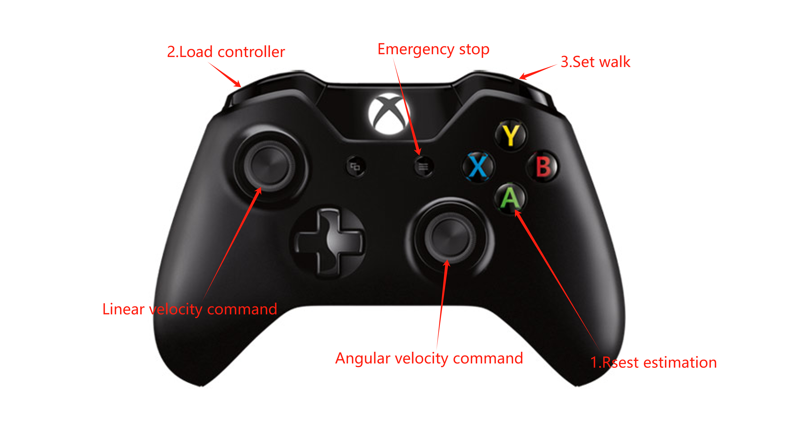

# hi_dynamic_control
An open source bipedal robot control framework for **Hi robot with serial ankle joint**, based on nonlinear MPC and WBC.


## Installation

### Install dependencies

- [OCS2](https://leggedrobotics.github.io/ocs2/installation.html#prerequisites)

- [ROS1-Noetic](http://wiki.ros.org/noetic)

### Install OCS2

OCS2 is a huge monorepo; **DO NOT** try to compile the whole repo. You only need to compile `ocs2_legged_robot_ros` and its dependencies by following the steps below.

You are supposed to clone the OCS2, pinocchio, and hpp-fcl as described in the documentation of OCS2.
```bash
# Clone OCS2
git clone https://github.com/leggedrobotics/ocs2.git
# Clone pinocchio
git clone --recurse-submodules https://github.com/leggedrobotics/pinocchio.git
# Clone hpp-fcl
git clone --recurse-submodules https://github.com/leggedrobotics/hpp-fcl.git
# Clone ocs2_robotic_assets
git clone https://github.com/leggedrobotics/ocs2_robotic_assets.git
# Install dependencies
sudo apt install liburdfdom-dev liboctomap-dev libassimp-dev
```

Compile the `ocs2_legged_robot_ros` package with [catkin tools](https://catkin-tools.readthedocs.io/en/latest/)instead of `catkin_make`. It will take you about ten minutes.

```bash
catkin config -DCMAKE_BUILD_TYPE=RelWithDebInfo 
catkin build ocs2_legged_robot_ros ocs2_self_collision_visualization
```

### Clone and Build

```shell

# Clone
mkdir -p <catkin_ws_name>/src
cd <catkin_ws_name>/src
git clone https://github.com/HighTorque-Robotics/hi_dynamic_control.git

# Clone SDK
git clone https://github.com/HighTorque-Robotics/livelybot_robot.git

# Install dependencies
sudo apt install libserialport0 libserialport-dev libreadline-dev

# Build
cd <catkin_ws_name>
catkin init
catkin config -DCMAKE_BUILD_TYPE=RelWithDebInfo

# for different use build 
# gazebo simulation 
catkin build pi_controllers pi_description pi_gazebo

# real robot deploy 
catkin build pi_controllers pi_description pi_bridge_hw

#  Robot hardware 
catkin build pi* yesense* livelybot*
```

## Gazebo Simulation

Run the gazebo simulation and load the controller:

```shell
roslaunch pi_controllers one_start_gazebo.launch    
```

***Notes:***
After the user starts the simulation, the robot will fall down in Gazebo.
Firstly the user needs to set **kp_position=60**, **kd_position=1** with rqt and reset the simulation by pressing **Ctrl+Shift+R** to reset robot. 



## Real Robot Deploy

Check port permissions of IMU devices and motor devices.
```bash
ls /dev/tty*
```

There will be five ACM devices, which are interfaces between imu and motors. Give them permissions so that the controller can read and write IO.
```bash
sudo chmod 777 /dev/tty*
```

Then you can launch the robot hardware.
```shell
roslaunch pi_controllers one_start_real.launch    
```

### Gamepad Control

1. Press A button Reset State Estimator

2. push the left joystick once，then press LB to load controller.

3. Press RB to set walk (Unnecessary for Hi).

4. Use the joystick to publish command velocity.



### Control Without Gamepad

1. reset_estimation

```shell
rostopic pub --once /reset_estimation std_msgs/Float32 "data: 0.0" 
```

2. load_controller

```shell
rostopic pub --once /load_controller std_msgs/Float32 "data: 0.0" 
```

3. publish a initial velocity with rqt gui tool

```shell
rosrun rqt_robot_steering rqt_robot_steering 
```

4. set_walk

```shell
rostopic pub --once /set_walk std_msgs/Float32 "data: 0.0" 
```

### Project Reference

[hunter_bipedal_control](https://bridgedp.github.io/hunter_bipedal_control)

[legged_control](https://github.com/qiayuanl/legged_control)

### Paper Reference

```
# State Estimation

[1] Flayols T, Del Prete A, Wensing P, et al. Experimental evaluation of simple estimators for humanoid robots[C]//2017 IEEE-RAS 17th International Conference on Humanoid Robotics (Humanoids). IEEE, 2017: 889-895.

[2] Bloesch M, Hutter M, Hoepflinger M A, et al. State estimation for legged robots-consistent fusion of leg kinematics and IMU[J]. Robotics, 2013, 17: 17-24.

# MPC

[3] Di Carlo J, Wensing P M, Katz B, et al. Dynamic locomotion in the mit cheetah 3 through convex model-predictive control[C]//2018 IEEE/RSJ international conference on intelligent robots and systems (IROS). IEEE, 2018: 1-9.

[4] Grandia R, Jenelten F, Yang S, et al. Perceptive Locomotion Through Nonlinear Model-Predictive Control[J]. IEEE Transactions on Robotics, 2023.

[5] Sleiman J P, Farshidian F, Minniti M V, et al. A unified mpc framework for whole-body dynamic locomotion and manipulation[J]. IEEE Robotics and Automation Letters, 2021, 6(3): 4688-4695.

# WBC

[6] Bellicoso C D, Gehring C, Hwangbo J, et al. Perception-less terrain adaptation through whole body control and hierarchical optimization[C]//2016 IEEE-RAS 16th International Conference on Humanoid Robots (Humanoids). IEEE, 2016: 558-564.

[7] Kim D, Di Carlo J, Katz B, et al. Highly dynamic quadruped locomotion via whole-body impulse control and model predictive control[J]. arXiv preprint arXiv:1909.06586, 2019.
```
